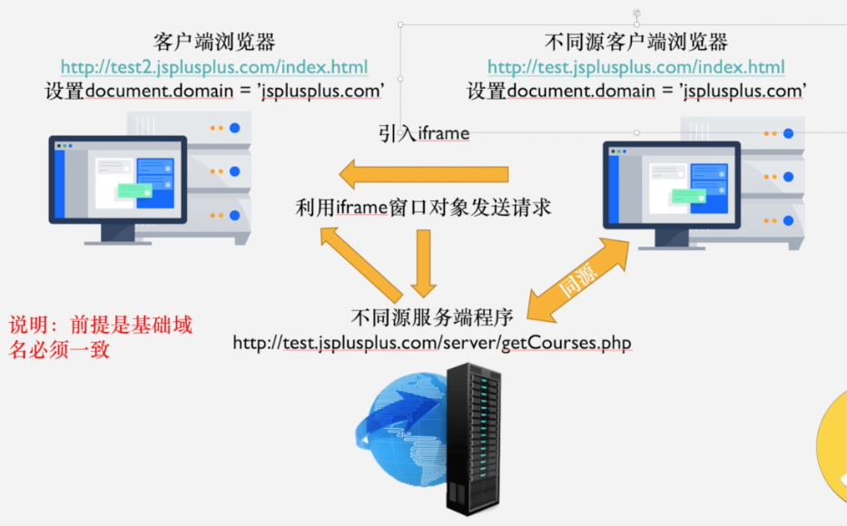

# 本工程目的

通过设置文档 domain 和 iframe 来实现跨域访问。

# 文件夹结构

1. server1 文件夹是测试服务器相关
2. server1 下 html 文件为 iframe 引入的文件
3. test 下 html 问访问接口测试文件

# 如何使用

按如下操作开启服务器：

> cd server1 
> yarn 
> yarn dev

然后在 vscode 下右键 test 文件夹下网页 index.html，点击 Open with Live Server。

打开网页后开启控制台，就可以看到效果。

# 思路

实现此跨域方式主要两点：

1. 以本工程为例，测试文档和 iframe 内文档要设置相同 domain，不设置会报跨域错误。

- 设置 domain 错误会报：
  Failed to set the 'domain' property on 'Document': '127.0.0.11' is not a suffix of '127.0.0.1'

2. 通过 iframe 内部 ajax 函数来访问同源接口，以免跨域。

[详细了解文档第二种方式](https://www.yuque.com/x-mitsui/rgyn98/irap09#uJLRG)

`注意：最好将Network下Disable cache勾选上，便于调试。`
