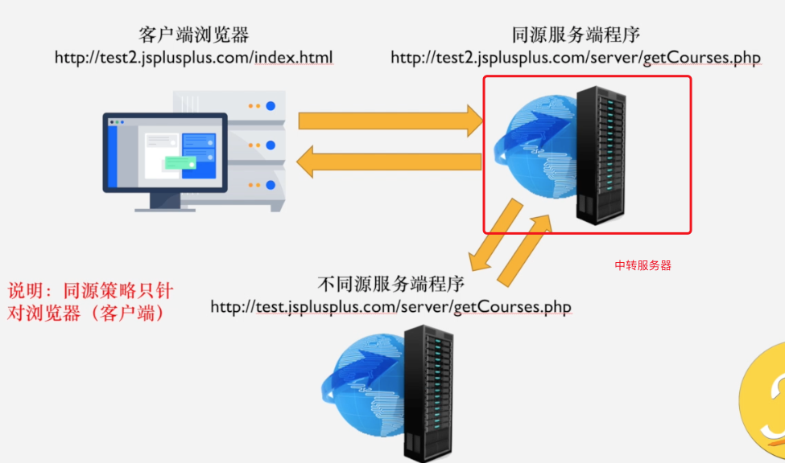

# 本工程目的

通过中转服务器实现跨域，因为服务器间访问不受跨域影响。

# 文件夹结构

1. server1 为目标接口测试服务器
2. server2 为中转服务器
3. server2 下 html 文件为访问目标接口的页面，它通过 server2 服务器为其转发接口，从而实现“跨域”访问。

# 如何使用

1. cd 到 server1 和 server2 文件夹，分别执行 yarn install
   然后分别执行 yarn dev

2. 访问 http://127.0.0.1:8082/test (server2 下 html 文件)

3. 打开控制台，观察输出。

   `建议将控制台Network下Disabled cache勾选，便于测试`
