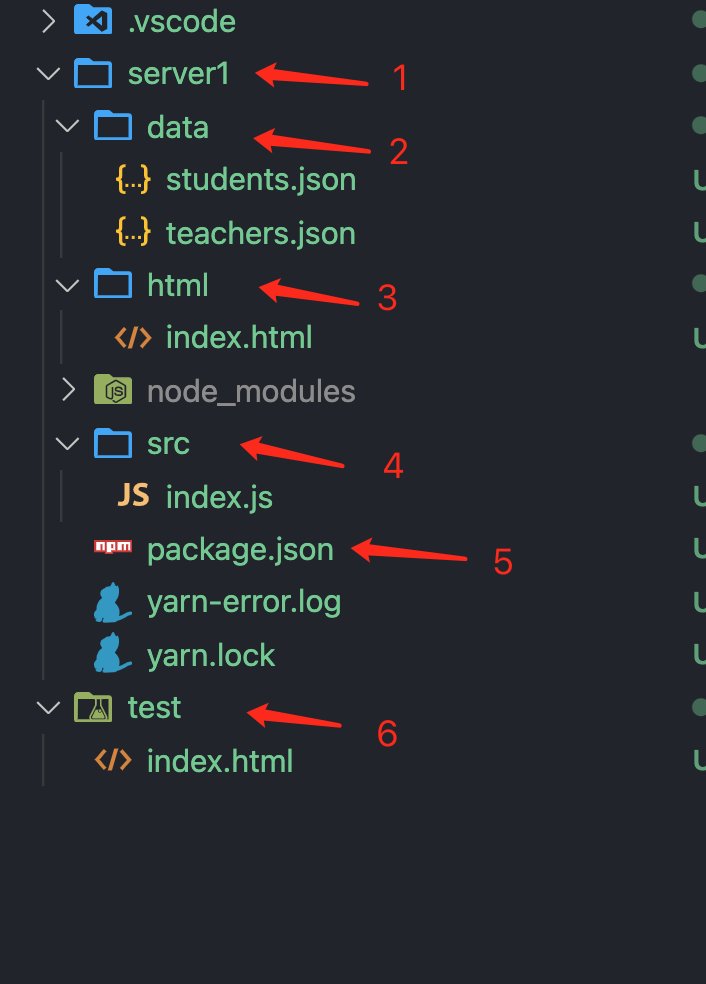

# 本工程目的

重现跨域问题，并提供解决思路。

# 文件夹结构

1. 为测试服务器 server1
2. 利用 json 文件形式模拟数据库数据
3. 为模拟与服务器同源的 html 文件，将文件夹建立在 server1 下
4. 服务器 server1 逻辑业务代码，为 html 文件提供数据 api
5. 服务器文件配置
6. 非同源 html 文件

   

# 如何使用

按如下操作开启服务器：

> cd server1 
> yarn install 
> yarn dev

然后打开 test 文件夹下网页 index.html

打开网页后开启控制台，就可以看到效果。

`注意：最好将Network下Disable cache勾选上，便于调试。`
